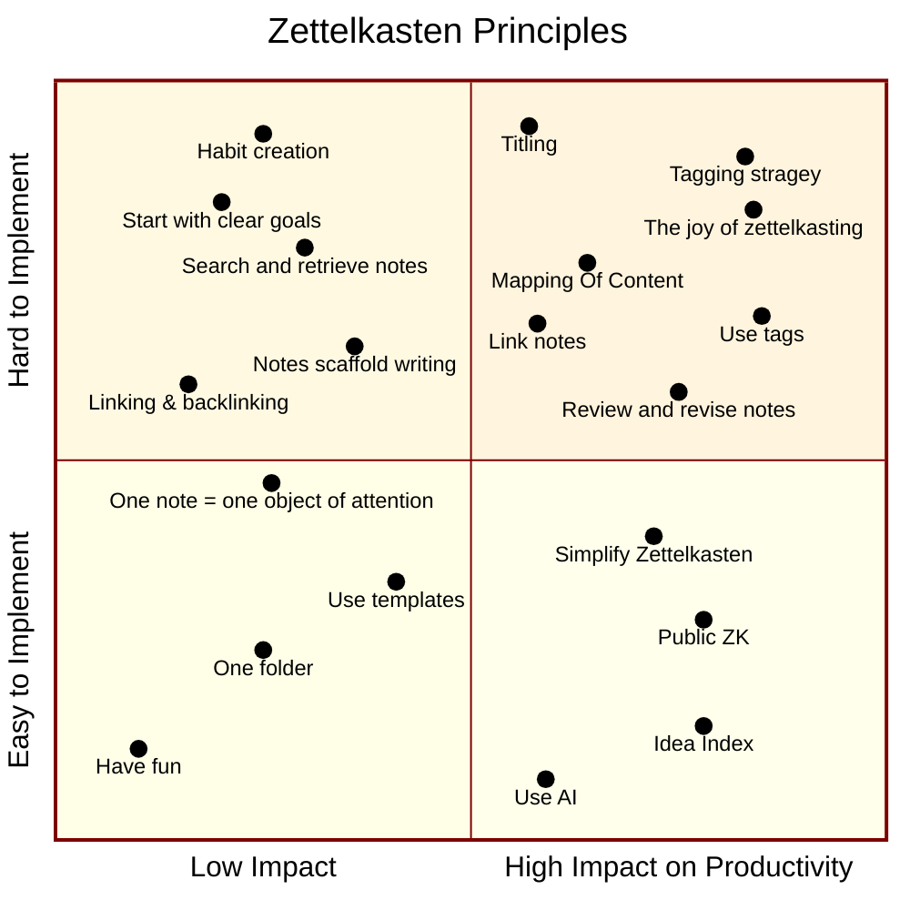

Mermaid Quadrant Chart Code  
- [Online FlowChart & Diagrams Editor - Mermaid Live Editor](https://mermaid.live/edit#pako:eNptkkFPg0AQhf_KZM7QQFlK4WCibY0H60EPJkoPY5kCCbAISy02_e8uUNsE3dPufG8ej9k94lZGjAF-NhRVVKhFQpUKC9BLpSpjeGbaJkBFBFzEFHPOhQK5gy3lJaVxUQ_ig0mHtIZH-XXuMM0beEjjZDgOovYqWl3NLsprbZD_ZjJteGWoE9lkOsWh1GFGgik8MUegJJSVzKXiEXd0CpP3lDX0hwlYUwsfDGmum_d89l6c_w9uA3i3Jo4B1mS2GbG7ngm3g1NnTBc9db2-1R_TZU-9eUcdMaarwdn6n94PmfrvevMNGphzlVMa6Zs8dtoQVaInGWKgtxHvqMlUiGFx0lJqlHxpiy0GqmrYwEo2cYLBjrJan5oy0jNaphRXlF-qeuYYHPGAgW2JifB933Xd2UxYs6kwsMXAnfjdcjxPCFuXnZOB31JqB9tAjlIlq_Xw0voH1zu-9bwLcfoBQ7rGfQ)    
    
- [Theme Configuration | Mermaid](https://mermaid.js.org/config/theming.html)  
**References**  
- *Quadrant Chart | Mermaid*. ~[https://mermaid.js.org/syntax/quadrantChart.html](https://mermaid.js.org/syntax/quadrantChart.html)~. Accessed 31 May 2024.   
- Mills, C. Wright. “On Intellectual Craftsmanship (1952).” Society, vol. 17, no. 2, 1980, pp. 63–70, https://doi.org/10.1007/bf02700062.

1. Linking and backlinking
2. Deciding on tags to apply
3. Organizing summary notes
4. (In future) writing abstracts for larger notes
5. Adding to and revising notes (Bayesian)
6. (In future) using notes for blog posts
7. Public ZK
8. MOC-Map Of Content
9. Titling
10. Idea Index
11. unpredictable coonections
12. Habit creation
13. Searching for the joy of zettelkasting
14. Finding the joy of zettelkasting