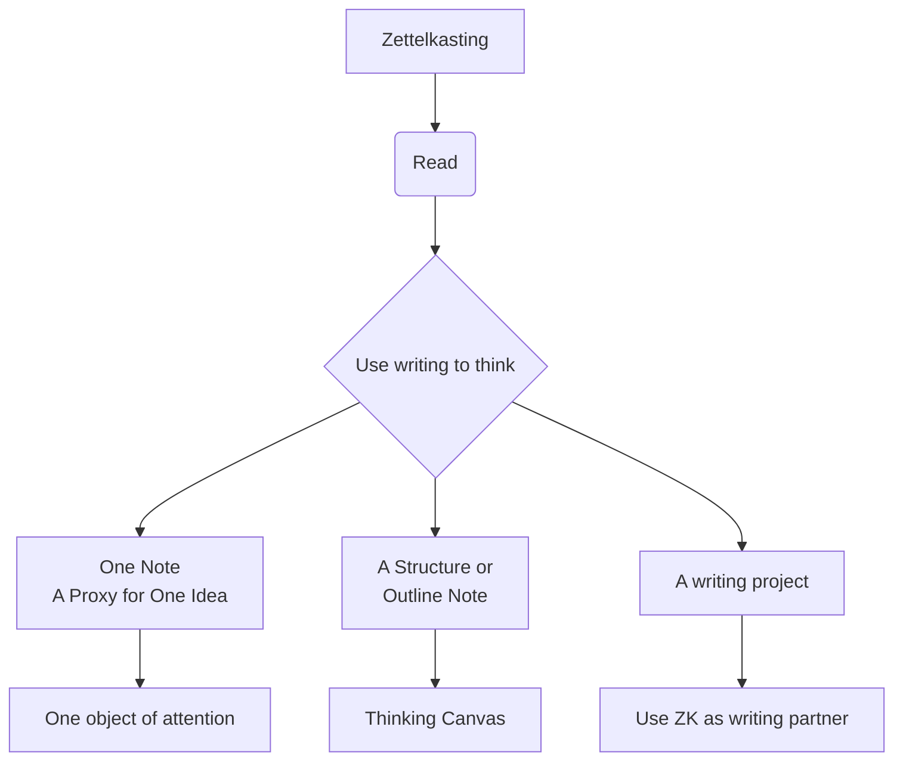
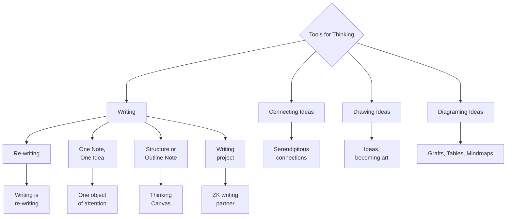

```mermaid
flowchart TD
    A[Zettelkasting] --> B(Read)
    B --> C{Use writing to think}
    C --> D[One Note \n A Proxy for One Idea]
    C --> E[A Structure or \nOutline Note]
    C --> F[A writing project]
    D --> G[One object of attention]
    E --> H[Thinking Canvas]
    F --> I[Use ZK as writing partner]
```

```mermaid
    flowchart TD
    A{Tools for Thinking}
    A ---> C[Writing]
    C --> E2[Re-writing]
    A ---> E3[Connecting Ideas]
    A ---> E4[Drawing Ideas]
    A ---> J[Diagraming Ideas]
    J --> K[Grafts, Tables, Mindmaps]
    E2 --> E6[Writing is \n re-writing]
    E3 --> E7[ Serendipitous \n connections]
    E4 --> E5[Ideas, \n becoming art]
    C --> D[One Note, \n One Idea]
    C --> E[Structure or \n Outline Note]
    C --> F[Writing \n project]
    D --> G[One object \n of attention]
    E --> H[Thinking \n Canvas]
    F --> I[ZK writing \n partner]

```    

Diagram types: timelines / transitions between states / input-output diagrams / graphs / trees / boxes / tables.