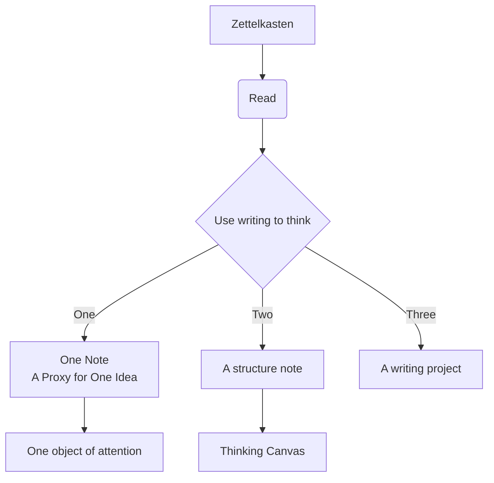

```mermaid
flowchart TD
    A[Zettelkasten] --> B(Read)
    B --> C{Use writing to think}
    C -->|One| D[One Note \n A Proxy for One Idea]
    C -->|Two| E[A structure note]
    C -->|Three| F[A writing project]
    D --> G[One object of attention]
    E --> H[Thinking Canvas]

```    