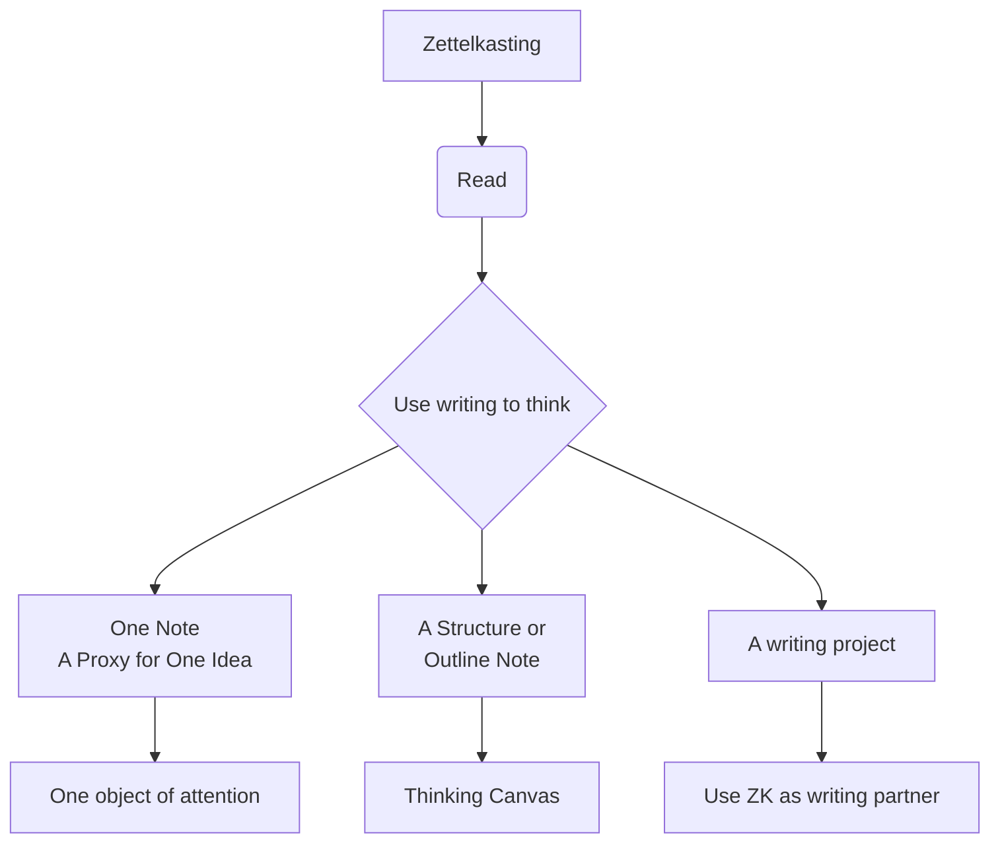

```mermaid
flowchart TD
    A[Zettelkasting] --> B(Read)
    B --> C{Use writing to think}
    C --> D[One Note \n A Proxy for One Idea]
    C --> E[A Structure or \nOutline Note]
    C --> F[A writing project]
    D --> G[One object of attention]
    E --> H[Thinking Canvas]
    F --> I[Use ZK as writing partner]

```    